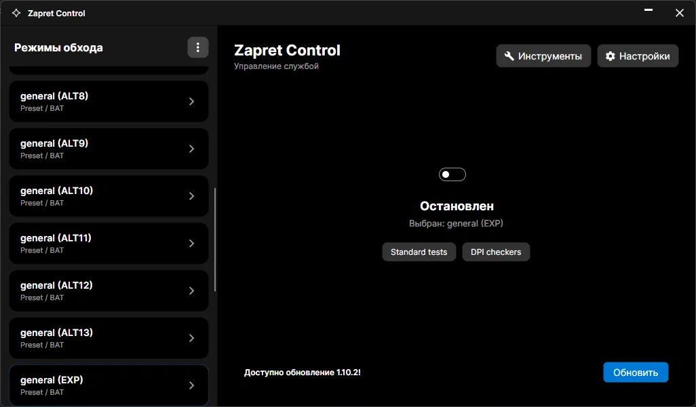

# 🛡️ Zapret Control

GUI-обёртка для [zapret-discord-youtube](https://github.com/flowseal/zapret-discord-youtube) под Windows.

 

---

## Источник обновлений

Все релизы, конфиги и `winws.exe` скачиваются из официального репозитория:

> **[flowseal/zapret-discord-youtube](https://github.com/flowseal/zapret-discord-youtube)**

Zapret Control — только GUI. Проблемы с обходом, DPI, конфигами — репортить авторам zapret.

---

## Требования

- Windows 10 / 11 (x64)
- [.NET 10 Desktop Runtime](https://dotnet.microsoft.com/download/dotnet/10.0)
- Права администратора

## Установка

1. Скачайте `.zip` из [Releases](../../releases/latest) и распакуйте в любую папку.
2. Запустите `ZapretGui.exe` — примите UAC.
3. Если zapret не установлен — нажмите **Обновить** на главной или укажите путь в **Настройки → Путь к папке Zapret**.

Данные хранятся в `%USERPROFILE%\Documents\zapret\` — версии, логи, `config.json`.

---

## Лицензия

MIT · [LICENSE](LICENSE)

**[Официальный репозиторий Zapret](https://github.com/flowseal/zapret-discord-youtube)** · **[Issues](../../issues)** · **[Releases](../../releases)**

